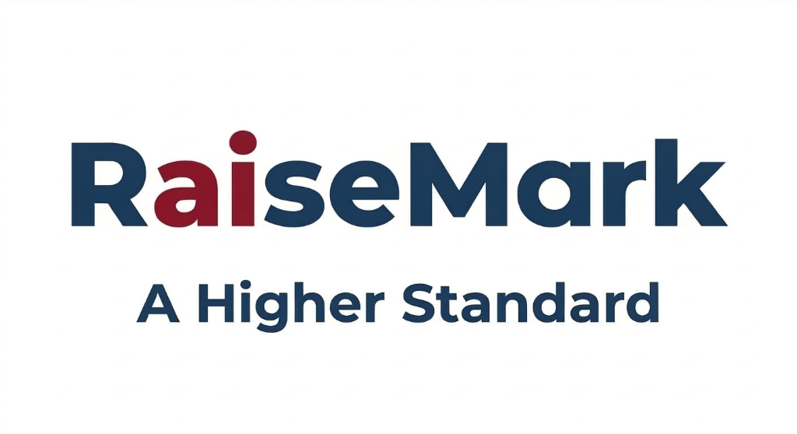

# RaiseMark Website — Developer & Maintainer Guide

Welcome to the **RaiseMark** website codebase! This document provides a complete guide for running, maintaining, and updating the site at [raisemarkai.com](https://raisemarkai.com).

---

## 🛠️ Full Tech Stack Overview

The RaiseMark website is built as a high-performance, lightweight **static web application**. There are no heavy build tools, frameworks, or database servers required.

| Layer | Technology / Tool | Description |
| :--- | :--- | :--- |
| **Markup** | HTML5 | Semantic HTML structure, ARIA accessibility features, JSON-LD Schema markup. |
| **Styling** | Native CSS3 | Pure CSS (`css/global.css` & `css/policy-check-up.css`) using CSS variables, Flexbox, and CSS Grid. |
| **Scripting** | Vanilla JavaScript (ES6+) | `js/script.js` handles mobile navigation, accessibility live updates, and form submissions. `js/policy-check-up.js` powers the interactive audit tool. |
| **Form Backend** | Formspree API | Contact form submissions are handled via AJAX (`fetch`) to Formspree for inline feedback without page reloads. |
| **Analytics** | Google Tag Manager / GA4 | Google Analytics 4 (`gtag.js` ID: `G-ZL8Q68XWCF`). |
| **SEO & Meta** | Open Graph & Structured Data | Custom OG tags on every page and JSON-LD `ProfessionalService` schema for search engine optimization. |
| **Hosting** | GitHub Pages | Hosted via GitHub Pages, custom domain configured via `CNAME` (`raisemarkai.com`). |

---

## 📁 Repository Structure

```
website/
├── index.html                  # Homepage
├── about.html                  # Mission, vision, and company background
├── team.html                   # Team profiles and bio cards
├── method.html                 # Proprietary Method (Compass, Map, Path)
├── ai-360-review.html          # AI 360 Review diagnostic (Compass Stage)
├── articles.html               # Article directory and resource hub
├── article-*.html              # Individual research briefings and articles
├── policy-check-up.html        # Interactive K-12 AI Policy Check-Up tool
├── ai-policy-tracker.html      # 50-State K-12 AI Policy Legal Tracker
├── contact.html                # Contact page with Formspree contact form
├── css/
│   ├── global.css              # Main stylesheet (color variables, header/footer, grid system)
│   └── policy-check-up.css     # Custom styling for interactive quiz tool
├── js/
│   ├── script.js               # Navigation menu toggle, global interaction, form submission logic
│   └── policy-check-up.js      # Logic for interactive score calculation and recommendations
├── assets/                     # Logos, article images, favicons, and media
├── CNAME                       # GitHub Pages custom domain configuration (raisemarkai.com)
├── sitemap.xml                 # XML Sitemap for search engines
├── robots.txt                  # Search crawler instructions
└── README.md                   # Maintainer guidance (this file)
```

---

## 🚀 How to Run the Website Locally

Since the site consists of static files, running it locally requires no build commands or `npm install`.

### Step 1: Clone the Repository
```bash
git clone https://github.com/andrewgitnersolutions/PaiR.git website
cd website
```

### Step 2: Start a Local Web Server
Using a local HTTP server ensures absolute paths, relative links, and asset fetches work properly.

- **Option A (Python 3 - Recommended):**
  ```bash
  python3 -m http.server 8000
  ```
  Then open: `http://localhost:8000`

- **Option B (VS Code Live Server Extension):**
  Open the directory in VS Code, right-click `index.html`, and select **"Open with Live Server"**.

- **Option C (Node.js / npx):**
  ```bash
  npx serve .
  ```

---

## 📝 Step-by-Step Instructions: How to Add Something to the Website

### Scenario 1: Adding a New Article or Research Briefing

1. **Create the Article File**:
   Copy an existing article HTML file (such as `article-readiness-mirage.html`) and name it using a descriptive URL slug (e.g., `article-ai-privacy.html`).

2. **Add Assets**:
   Place any images for the article inside the `assets/` directory (e.g., `assets/ai-privacy-hero.png`).

3. **Update `<head>` Metadata**:
   Open `article-ai-privacy.html` and update:
   - `<title>`: E.g., `Student Data Privacy in K-12 AI | RaiseMark`
   - `<meta name="description">`: Concise 1-2 sentence summary.
   - Open Graph tags (`og:title`, `og:description`, `og:image`, `og:url`).
   - Twitter card tags (`twitter:title`, `twitter:description`, `twitter:image`, `twitter:url`).

4. **Add Content**:
   Inside `<main id="main-content">`, edit the title, publishing date, category metadata, and article body paragraphs.

5. **Link the Article on `articles.html`**:
   Open `articles.html` and insert a new `<article class="article-card">` snippet inside the `.articles-grid` container:
   ```html
   <article class="article-card">
       <div class="article-card__img" style="background-image: url('assets/ai-privacy-hero.png'); background-size: cover; background-position: center;"></div>
       <div class="article-card__body">
           <div class="article-card__meta"><span>Privacy & Compliance</span><span>5 min read</span></div>
           <h3 class="article-card__title">Student Data Privacy in K-12 AI</h3>
           <p>Key strategies for protecting student PII when evaluating generative AI tools.</p>
           <a href="article-ai-privacy.html" class="article-card__link">Read Full Article &rarr;</a>
       </div>
   </article>
   ```

6. **Update `sitemap.xml`**:
   Open `sitemap.xml` and add your new page URL so Google indexes it:
   ```xml
   <url>
     <loc>https://raisemarkai.com/article-ai-privacy.html</loc>
     <lastmod>2026-07-28</lastmod>
     <priority>0.80</priority>
   </url>
   ```

---

### Scenario 2: Adding a New Page to the Header / Main Navigation

1. **Create the New Page**:
   Create `new-page.html`. Ensure it includes the global header structure:
   ```html
   <header class="site-header">
       <div class="container header-inner">
           <a href="index.html" class="brand-logo">
               
           </a>
           <nav>
               <ul class="nav-links" id="nav-links">
                   <li><a href="about.html" class="nav-link">About</a></li>
                   <li><a href="team.html" class="nav-link">Team</a></li>
                   <li><a href="method.html" class="nav-link">Method</a></li>
                   <li><a href="ai-360-review.html" class="nav-link">360 Review</a></li>
                   <li><a href="articles.html" class="nav-link">Articles</a></li>
                   <li><a href="new-page.html" class="nav-link active">New Page</a></li>
                   <li><a href="policy-check-up.html" class="nav-link">Policy Check-Up</a></li>
                   <li><a href="contact.html" class="btn btn--primary btn--sm">Work With Us</a></li>
               </ul>
           </nav>
           <button class="mobile-toggle" aria-label="Toggle menu" aria-expanded="false" aria-controls="nav-links">
               <span></span><span></span><span></span>
           </button>
       </div>
   </header>
   ```

2. **Sync Navigation Across All Pages**:
   Update the `<ul class="nav-links">` list across all existing HTML files (`index.html`, `about.html`, `team.html`, `method.html`, `articles.html`, `contact.html`, etc.) so the header menu remains identical site-wide.

3. **Add to `sitemap.xml`**:
   Add the new URL to `sitemap.xml`.

---

### Scenario 3: Modifying Styles, Colors, or Fonts

- Global design variables (colors, fonts, line-heights, container sizes) are located in **`css/global.css`** under the `:root` selector:
  ```css
  :root {
      --color-primary: #...;
      --color-accent: #...;
      --font-family: ...;
  }
  ```
- Make adjustments to `css/global.css` for site-wide visual tweaks.

---

## 🤝 Partner Review & Staging Workflow

To ensure that partners (**Dwight Jones**, **Don Peterson**, and **Andrew Gitner**) can review proposed website changes and discuss them before they go public, the project uses a two-tier release workflow:

```
[ Antigravity / staging branch ]
             │
             ▼
[ Private Staging Preview Site: andrewgitnersolutions.github.io/raisemark-staging/ ]
             │
             │ (Dwight & Don review, discuss in Google Doc / Email, and approve)
             ▼
[ /raisemark-website-push-to-prod ]
             │
             ▼
[ public branch ➔ main branch ➔ raisemarkai.com (Live Web) ]
```

### 1. Developing on the `staging` Branch
- All day-to-day conversational editing with Antigravity happens on the **`staging`** branch.
- To deploy your latest work to the partner staging site, run:
  ```bash
  ./scripts/deploy-staging.sh
  ```
  *(or push to the `staging` branch on GitHub).*
- The private staging preview updates within seconds at:
  👉 **`https://andrewgitnersolutions.github.io/raisemark-staging/`**

### 2. Partner Review & Discussion
- Share the staging link with Dwight and Don.
- The staging preview features a top **Partner Review Bar** that allows partners to:
  - Open the **Partner Review Notes Google Doc** in Google Drive (`Website Management` folder).
  - Open a pre-addressed email thread to all three partners.
  - Compare pages side-by-side with the live production site.
- Record any copy edits, legal adjustments, or pricing reviews in the notes document.

### 3. Deploying Approved Changes to Production

Once partner sign-off is complete, you have two simple ways to deploy to the live site:

- **Option A (Inside Antigravity — Recommended):**
  Simply type the action command:
  ```text
  /raisemark-website-push-to-prod
  ```
  Antigravity will verify all pre-flight checks, merge `staging` into `public`, and push directly to `main` on GitHub to launch the updates live to [raisemarkai.com](https://raisemarkai.com).

- **Option B (Terminal Command):**
  Run the promotion script directly:
  ```bash
  ./scripts/publish-to-public.sh
  ```

Changes take approximately **1 to 2 minutes** to build and publish on [raisemarkai.com](https://raisemarkai.com).
